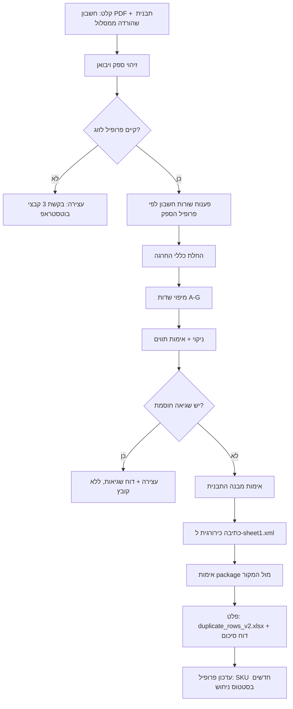

# מפרט פיתוח: מחולל קבצי ייבוא למערכת מסלול (מכון התקנים)

**גרסה:** 1.0 | **תאריך:** 15/09/2026 | **בעלים:** משה, H. Caspi & Co.
**סטטוס:** מוכן לפיתוח שלב 1 (הפקת קובץ אקסל). שלב 2 (אוטומציית UI) – תכנון בלבד.

---

## 1. מטרה

כלי שמקבל חשבון ספק (PDF) של לקוח, ומפיק ממנו קובץ `duplicate_rows_v2.xlsx` מוכן להעלאה לבקשת אישור תקן במערכת מסלול – **רק** עבור זוג לקוח+ספק שיש לו פרופיל מיפוי שנלמד מבקשה מאושרת.

### בתוך ההיקף (שלב 1)
- פענוח חשבון ספק לפי פרופיל הספק.
- זיהוי זוג לקוח+ספק ובחירת פרופיל מיפוי.
- החלת כללי מיפוי (פרט מכס, קוד דגם, תיאור, כמויות, החרגות).
- ניקוי ואימות ערכים ברמת התו.
- כתיבה כירורגית לתבנית בלי לפגוע במבנה ה-package.
- דוח סיכום שורות עם סטטוס מאומת / ניחוש / חסום.
- תמיכה בתהליך בוטסטראפ לזוג חדש (כלי עזר, לא אוטומטי לגמרי).

### מחוץ להיקף (שלב 1)
- העלאת הקובץ למסלול וביצוע "שכפול שורה" בממשק – נשאר ידני.
- מילוי כותרת הבקשה (יבואן, ספק, שטר, צרופות) – נשאר ידני.
- סיווג מכס אוטומטי לקודי HS חדשים.

---

## 2. מונחים

| מונח | משמעות |
|---|---|
| זוג (Pair) | שילוב יבואן (ח.פ) + ספק זר. יחידת הלמידה והמיפוי. |
| פרופיל מיפוי | קובץ הגדרות לזוג אחד: כללים + טבלת SKU ← קוד דגם. |
| בוטסטראפ | למידה חד-פעמית של זוג מתוך בקשה מאושרת + החשבון שממנו הופקה + התבנית. |
| SKU / קוד חומר | המזהה של הפריט בחשבון הספק (Material אצל יוניליוור, Item No אצל ג'ינאן). |
| מאומת ✅ | ערך שנצפה בפועל בבקשה מאושרת במסלול או אושר במפורש ע"י המשתמש. |
| ניחוש ⚠️ | ערך שנגזר מדפוס. מותר להפיק, חובה לסמן. |
| חסום ⛔ | שדה שאין לו כלל פתור. אסור להפיק ערך – נדרשת הכרעת משתמש. |

---

## 3. זרימה כללית



**עיקרון על:** כל חוסר ודאות = עצירה ודיווח. אין תיקון שקט, אין השלמה בהנחה, אין השאלת כללים בין זוגות.

---

## 4. ארכיטקטורה – מודולים

| מודול | אחריות | הערות |
|---|---|---|
| `invoice_parsers/` | פרסר לכל פורמט חשבון ספק. מחזיר רשימת `InvoiceLine` אחידה. | פרסר נבחר לפי פרופיל, לא לפי ניחוש. |
| `pair_resolver` | מזהה יבואן + ספק ומאתר פרופיל. | התאמה לפי מזהים מוגדרים בפרופיל בלבד. |
| `profiles/` | פרופילי מיפוי (YAML) + טבלאות SKU. | ר' סעיף 6. |
| `rules_engine` | מחיל החרגות וממפה שדות A-G. | כל כלל מוגדר בפרופיל, לא בקוד. |
| `sanitizer` | ניקוי וולידציה ברמת התו. | ר' סעיף 8. |
| `template_inspector` | מאמת שהתבנית שהועלתה תואמת למבנה הצפוי. | ר' סעיף 7.2. |
| `template_writer` | כתיבה כירורגית ל-XML ואריזה מחדש. | ר' סעיף 7.3. **קריטי.** |
| `package_verifier` | השוואת הפלט למקור. | ר' סעיף 7.4. |
| `reporter` | דוח סיכום למשתמש. | ר' סעיף 10. |
| `bootstrap_assistant` | עזר להשוואת בקשה מאושרת מול חשבון ויצירת טיוטת פרופיל. | דורש אישור משתמש. |

### מבנה נתונים פנימי

```python
@dataclass
class InvoiceLine:
    line_no: int             # מספר שורה בחשבון
    sku: str                 # Material / Item No
    description: str         # תיאור גולמי כפי שחולץ
    hs_code: str | None      # Commodity code אם קיים בחשבון
    qty: Decimal | None      # כמות לפי העמודה שהפרופיל מגדיר
    qty_unit: str | None
    unit_price: Decimal | None
    raw: dict                # כל השדות הגולמיים, לצורך דיבוג

@dataclass
class OutputRow:
    source_line: int
    A: str | None; B: str | None; C: str | None
    D: Decimal | None; E: Decimal | None; F: Decimal | None; G: Decimal | None
    status: dict[str, Literal["verified", "guess", "blocked"]]  # לכל עמודה
    notes: list[str]
```

---

## 5. תהליך בוטסטראפ (זוג חדש)

### 5.1 תנאי כניסה – שלושה קבצים חובה
1. PDF של בקשה מאושרת במסלול, מאותו יבואן ואותו ספק.
2. חשבון הספק שממנו הופקה אותה בקשה (עדיף אותו חשבון בדיוק).
3. קובץ התבנית שהורד ממסלול לסוג הבקשה.

חסר קובץ אחד → המערכת לא מפיקה כלום. אם החשבון אינו זה שממנו הופקה הבקשה → כל כלל שנלמד מסומן "ניחוש" ונרשם בפרופיל `bootstrap.exact_invoice_match: false`.

### 5.2 שלבים
1. תיעוד: יבואן + ח.פ, ספק כפי שמופיע בחשבון, מספר בקשה, מספר ותאריך חשבון.
2. אימות מבנה התבנית מול ברירת המחדל (סעיף 7.1). חריגה → נרשמת בפרופיל הזוג בלבד.
3. התאמה שורה-לשורה בין החשבון לבקשה, ומילוי: פרט מכס / תיאור / החרגות / כמויות / קוד דגם / פו"ב.
4. שורת חשבון שאינה בבקשה → לזהות מה מבדיל אותה; לא ברור → שאלה למשתמש.
5. כלל מדוגמה אחת או לא עקבי → `blocked` + הצגת החלופות שנצפו.
6. בניית טבלת SKU ← קוד דגם עם סטטוס לכל שורה.
7. שמירת פרופיל בשם `<ספק>-<לקוח>.yaml`.
8. סיכום למשתמש; הפקה לחשבונות נוספים רק אחרי אישורו.

### 5.3 אסור
- להעביר כלל מזוג אחר, גם אם הספק או המוצר דומים.
- לסמן "מאומת" בלי תצפית בבקשה מאושרת או אישור מפורש.
- להסיק כלל מ"נראה הגיוני".

---

## 6. פרופיל מיפוי – סכמה

```yaml
pair_id: unilever-europe__unilever-israel
importer:
  name: "יוניליוור ישראל טיפוח אישי וביתי בע"
  company_id: "510516578"
supplier:
  name: "Unilever Europe BV"
  match: ["unilever europe bv"]         # השוואה אחרי lowercase + trim
invoice_parser: unilever_europe_v1
bootstrap:
  approved_request: "10118471"
  source_invoice: "7113487000"
  exact_invoice_match: true
  learned_at: "2026-08-25"

template:
  expected: default                      # או מבנה חריג מלא

exclusions:
  - id: ml50
    type: regex_on_description
    pattern: '(?<!\d)50ML'
    status: verified

columns:
  A: { type: hs_map, map: { "33072000": "3307200000/4" }, on_unknown: block }
  B: { type: sku_table, on_unknown: guess_unilever_v1 }
  C: { type: constant, value: "מנפיקי אירוסול", status: verified }
  D: { type: invoice_qty, field: qty_in_zun, status: verified }
  E: { type: same_as, col: D, status: verified }
  F: { type: same_as, col: D, status: verified }
  G: { type: skip, reason: "לא חובה – אישור לקוח" }

sku_table:
  "65223606": { model: "RFW AP 150ML FROZEN ACAI JASMINE", status: verified }
  # ...
```

**סוגי כללים נתמכים (`type`):** `constant`, `hs_map`, `sku_table`, `invoice_field`, `invoice_qty`, `same_as`, `skip`, `blocked` (שדה לא פתור – מחייב קלט ידני לכל שורה).

**`on_unknown`:** `block` (ברירת מחדל) / `guess_<algo>` (מפיק ערך ומסמן ⚠️).

---

## 7. תבנית מסלול – מפרט טכני

### 7.1 מבנה ברירת מחדל (נבדק על `duplicate_rows_v2.xlsx`)

| עמודה | שדה | סוג | ולידציה בתבנית (dataValidation) |
|---|---|---|---|
| A | פרט מכס | טקסט | אורך בדיוק 12 (10 ספרות + `/` + ספרה) |
| B | קוד דגם | טקסט | אורך 0–35. הנחיית התבנית: **אנגלית, ספרות, רווחים ותווי מקלדת בלבד** – אין עברית |
| C | תיאור טובין | טקסט | עד 140, עברית/אנגלית, ללא ירידת שורה |
| D | כמות לפי ספר המכס | מספר | 9 ספרות + 2 עשרוניות |
| E | כמות | מספר | 9 ספרות + 2 עשרוניות |
| F | כמות עבור מכון התקנים | מספר | 9 ספרות + 2 עשרוניות |
| G | ערך פו"ב ליחידה | מספר | 10 ספרות + 2 עשרוניות, 0–9999999999.99 |

- גיליון יחיד, `rightToLeft="1"`, `dimension` = `A1:PW203`.
- שורות 1–2 כותרות, שורה 3 הנחיות, שורות 4–203 נתונים (200 שורות).
- ה-package מכיל 25 קבצים, כולל `xl/comments1.xml`, `xl/drawings/vmlDrawing1.vml`, `xl/drawings/drawing1.xml`, `customXml/*`, `printerSettings1.bin`.
- קשרים ב-`sheet1.xml.rels`: `rId1` printerSettings, `rId2` drawing, `rId3` vmlDrawing, `rId4` comments.
- סוף `sheet1.xml`: `<drawing r:id="rId2"/><legacyDrawing r:id="rId3"/>`.
- **מזהי ה-style (`s`) של תאי הנתונים אינם אחידים בין השורות** (למשל A: 24/9/11, C: 26/2/3/4). אסור להניח ערך קבוע – יש לקרוא ולשמר את ה-`s` של כל תא.

### 7.2 אימות תבנית לפני כתיבה (`template_inspector`)
- שם הקובץ שהועלה נשמר כפי שהוא לשם הפלט.
- `xl/worksheets/sheet1.xml` קיים, וכל תאי A4:G203 קיימים וריקים (`<c r=".." s=".."/>`).
- כותרות שורה 2 (דרך sharedStrings) = פרט מכס / קוד דגם / תיאור טובין / כמות לפי ספר המכס / כמות / כמות עבור מכון התקנים / ערך פו"ב ליחידה.
- 7 כללי dataValidation קיימים עם ה-sqref הצפויים.
- `legacyDrawing` ו-`drawing` קיימים.
- כל סטייה → עצירה ודיווח. לא לנסות להתאים אוטומטית.

### 7.3 כתיבה כירורגית (`template_writer`)

**איסור מוחלט:** לא לפתוח ולשמור את הקובץ עם ספרייה שכותבת מחדש את ה-package (`openpyxl.load_workbook` + `save`, pandas, xlsxwriter וכד'). זה שובר את קישורי comments/drawings וגורם בייבוא למסלול לשגיאה:
`Cannot read properties of undefined (reading 'comments')`.
גם `lxml` + serialize לא מומלץ – עלול לשנות הצהרות namespace. עובדים בהחלפת מחרוזות על ה-XML הגולמי.

כללים:
- טקסט (A, B, C): `<c r="A4" s="XX" t="inlineStr"><is><t>ערך</t></is></c>`. לא נוגעים ב-`sharedStrings.xml`.
- מספר (D–G): `<c r="D4" s="XX"><v>2688</v></c>`, ללא `t`.
- `s` נשמר מהתא המקורי.
- escape ל-`& < >` בערכי טקסט.
- קוד דגם מספרי (כמו `1002843.1` אצל ג'ינאן) נכתב **כטקסט** – לעולם לא כמספר.
- מספרים: ללא מפרידי אלפים, ללא כתיב מדעי, עד 2 עשרוניות.
- תא ריק בנתונים = לא נכתב כלל (נשאר כמו בתבנית), כדי שלא ידרוס בעת שכפול שורה.
- אריזה: אותו סדר קבצים, אותה שיטת דחיסה, אותם `ZipInfo`; רק `sheet1.xml` מוחלף.

**מימוש ייחוס (נבדק בפועל על התבנית עם 7 שורות הבקשה 10118471):**

```python
import re, zipfile
from decimal import Decimal
from xml.sax.saxutils import escape

SHEET = "xl/worksheets/sheet1.xml"
TEXT_COLS, NUM_COLS = set("ABC"), set("DEFG")

def _fmt_num(v):
    d = Decimal(str(v))
    if d < 0 or d != d.quantize(Decimal("0.01")):
        raise ValueError(f"מספר לא חוקי: {v}")
    return format(d.normalize(), "f")      # 1000 -> "1000", לא "1E+3"

def write_rows(template_path, out_path, rows, first_row=4, last_row=203):
    if len(rows) > last_row - first_row + 1:
        raise ValueError("יותר מ-200 שורות")
    zin = zipfile.ZipFile(template_path)
    xml = zin.read(SHEET).decode("utf-8")
    for i, row in enumerate(rows):
        r = first_row + i
        for col, val in row.items():
            if val is None or val == "":
                continue
            ref = f"{col}{r}"
            m = re.search(r'<c r="%s"( s="\d+")?\s*/>' % ref, xml)
            if not m:
                raise RuntimeError(f"תא {ref} לא נמצא ריק בתבנית")
            s_attr = m.group(1) or ""
            if col in TEXT_COLS:
                new = f'<c r="{ref}"{s_attr} t="inlineStr"><is><t>{escape(val)}</t></is></c>'
            elif col in NUM_COLS:
                new = f'<c r="{ref}"{s_attr}><v>{_fmt_num(val)}</v></c>'
            else:
                raise ValueError(f"עמודה לא נתמכת: {col}")
            xml = xml[:m.start()] + new + xml[m.end():]
    with zipfile.ZipFile(out_path, "w") as zout:
        for info in zin.infolist():
            data = xml.encode("utf-8") if info.filename == SHEET else zin.read(info.filename)
            zout.writestr(info, data, compress_type=info.compress_type)
```

### 7.4 אימות package אחרי כתיבה (`package_verifier`)

```python
def verify(template_path, out_path):
    a, b = zipfile.ZipFile(template_path), zipfile.ZipFile(out_path)
    assert [i.filename for i in a.infolist()] == [i.filename for i in b.infolist()]
    for n in a.namelist():
        if n != SHEET:
            assert a.read(n) == b.read(n), f"קובץ השתנה: {n}"
    x = b.read(SHEET).decode()
    assert '<drawing r:id="rId2"/>' in x and '<legacyDrawing r:id="rId3"/>' in x
    assert x.count("<c ") == a.read(SHEET).decode().count("<c ")
    return True
```

בנוסף: קריאה חוזרת של הפלט (read-only, בלי save) והשוואת כל ערך לערך שתוכנן. כשל באחד מהאימותים → הקובץ לא נמסר.

---

## 8. ניקוי ואימות ערכים (`sanitizer`)

סדר פעולות לכל ערך טקסט:
1. הסרת תווים בלתי נראים: NBSP (U+00A0), TAB, CR, LF, LRM/RLM (U+200E/U+200F), ZWSP (U+200B), BOM.
2. trim בתחילה ובסוף.
3. כיווץ רווחים כפולים לרווח יחיד (אלא אם הפרופיל מגדיר אחרת לאותו SKU).
4. בדיקת אורך אחרי הניקוי: A = בדיוק 12 ותואם `^\d{10}/\d$`; B ≤ 35 ורק ASCII מודפס; C ≤ 140 ללא ירידות שורה.
5. חריגה → הערך לא נכתב, השורה מסומנת `blocked`, והקובץ כולו לא מופק.

**ערך שנשבר לשתי שורות ב-PDF:** הפרסר חייב להחליט במפורש (רווח או חיבור) ולתעד את ההחלטה בדוח. בבקשה 10118471 שבירות כאלה (`RFM AP 150ML` / `MENTHOLBLUELAVENDER`, `...FROZEN ACAI` / `JASMINE`, `...FOR HER` / `CMR`) מייצגות **רווח**. כשהערך קיים בטבלת SKU מאומתת – הערך מהטבלה גובר תמיד.

**מספרים:** הסרת מפרידי אלפים ורווחים לפני המרה, בדיקת טווח לפי עמודה, כתיבה כמספר.

**דוח:** כל ערך טקסט מוצג במרכאות (`"DFW AP150ML PEAR ALOEVERA"`) כדי שרווחים יהיו גלויים.

---

## 9. תנאי עצירה (שגיאות חוסמות)

| קוד | מצב | פעולה |
|---|---|---|
| E01 | אין פרופיל לזוג | בקשת 3 קבצי בוטסטראפ |
| E02 | חסר קובץ תבנית / חשבון | עצירה |
| E03 | מבנה תבנית שונה מהצפוי | עצירה + פירוט ההבדל |
| E04 | קוד HS בחשבון שאין לו מיפוי | עצירה, הפניה לסיווג ידני |
| E05 | עמודה מוגדרת `blocked` בפרופיל | דרישת קלט ידני לכל שורה |
| E06 | ערך חורג באורך/פורמט אחרי ניקוי | עצירה + הצגת הערך |
| E07 | כמות חסרה / לא מספרית / מחוץ לטווח | עצירה |
| E08 | יותר מ-200 שורות אחרי החרגה | עצירה (או פיצול – לפי החלטת משתמש) |
| E09 | אימות package נכשל | הקובץ לא נמסר |
| E10 | שורת חשבון שלא מתאימה לכלל החרגה וגם לא מזוהה | עצירה + שאלה למשתמש |

אזהרות (לא חוסמות, מסומנות בדוח): SKU חדש עם קוד דגם בניחוש; כלל בפרופיל בסטטוס "לא אומת".

---

## 10. דוח סיכום (פלט למשתמש)

1. פרטי החשבון: ספק, מספר, תאריך, זוג שזוהה.
2. שורות שהוחרגו + הכלל שהחריג כל אחת.
3. טבלת שורות בקובץ:

| שורה בקובץ | שורה בחשבון | SKU | A | B | C | D/E/F | סטטוס |
|---|---|---|---|---|---|---|---|
| 4 | 1 | 65223592 | "3307200000/4" | "RFM AP 150ML ICED LEMON SAGE" | "מנפיקי אירוסול" | 2688 | ✅ |

4. רשימת ניחושים שדורשים אישור, עם התיאור הגולמי מהחשבון לצד הניחוש.
5. החלטות פרסור שבירת שורה.
6. תוצאת אימות package.
7. שם קובץ הפלט (זהה לשם התבנית).

---

## 11. פרופילים קיימים

### 11.1 יוניליוור ישראל + Unilever Europe BV

| נושא | כלל | סטטוס |
|---|---|---|
| זיהוי | יבואן ח.פ 510516578; ספק "unilever europe bv" | ✅ |
| פרט מכס (A) | Commodity `33072000` ← `3307200000/4` | ✅ |
| תיאור (C) | קבוע "מנפיקי אירוסול" (מנפקי אירוסול, ת"י 742, קבוצה 1) | ✅ |
| החרגה | תיאור מכיל `50ML` שאינו חלק מ-`150ML` (כולל `RO50ML`, `RO 50ML`) | ✅ |
| כמויות (D/E/F) | שלושתן = "Qty in ZUN" (לא "Qty" בקרטונים); יחידה "כל אחד" | ✅ |
| פו"ב (G) | לא ממלאים | ✅ (אישור לקוח) |
| קוד דגם (B) | טבלת Material; לחדש – ניחוש מסומן | ⚠️ כלל חיתוך לא פוענח |

**טבלת SKU נוכחית:**

| Material | קוד דגם | סטטוס |
|---|---|---|
| 65223606 | RFW AP 150ML FROZEN ACAI JASMINE | ✅ |
| 65228382 | DFW AP150ML PEAR ALOEVERA | ✅ |
| 65622047 | AXE BS 150ML ANARCHY FOR HER CMR | ✅ |
| 65223592 | RFM AP 150ML ICED LEMON SAGE | ✅ |
| 65223596 | RFM AP 150ML MENTHOLBLUELAVENDER | ✅ |
| 65227897 | DFW AP 150ML TALCO DAPHNE | ✅ |
| 65289781 | DFM AP 150ML CLEAN COMFORT | ✅ |
| 65223602 | RFW AP 150ML EUCALYPTSCOCONTWTR | ✅ (אישור משתמש) |
| 65622046 | AXE AP 150ML APOLLO CMR | ⚠️ |
| 65432433 | RFW AP150ML INVSBL ON BLK WHT CL | ⚠️ |
| 65546404 | AXE AP 150ML BLACK CMR MOP UP WAVE1 | ⚠️ |
| 65228009 | DFW AP 150ML CCNT JSMN FLWR | ⚠️ הכי לא ודאי |
| 65634622 | AXE BS 150ML BLACK IL CMR MOP UP | ⚠️ |
| 65634626 | AXE BS 150ML ICE CHILL CMR MOP UP | ⚠️ |
| 65664183 | RFM AP 150ML SPORT COOL | ⚠️ |
| 65223277 | — מוחרג (50ML) | — |
| 65436712 | — מוחרג (50ML) | — |

**אלגוריתם ניחוש `guess_unilever_v1` (לשימוש רק ל-SKU חדש, תמיד ⚠️):**
1. נקודת פתיחה: Description אחרי ניקוי.
2. הסרת סיומת אתר/אצווה מסוף המחרוזת לפי רשימת טוקנים שנצפו (`BE`, `BG`, `AT`, `HULK`, `SCNT`, `ZEUS`, `DMC`, `Y2`, ובהקשר סיומת גם `DAPH`/`DAPHNE`), כל עוד הטוקן בסוף.
3. אם עדיין מעל 35 תווים – הסרת טוקנים מהסוף עד ≤ 35, וסימון "חיתוך לפי אורך".
4. להציג בדוח את התיאור המלא, את התוצאה, ואת הטוקנים שהוסרו.

שימו לב: `DAPHNE` מופיע כחלק משם המוצר המאושר `DFW AP 150ML TALCO DAPHNE`, ו-`IL` הוסר במקרה אחד ונשאר באחר. לכן האלגוריתם הוא עזר לניחוש בלבד – לעולם לא מקדם ל-✅ אוטומטית.

### 11.2 המשווק סחר והנדסה + JINAN MECH PIPING TECHNOLOGY

| נושא | כלל | סטטוס |
|---|---|---|
| זיהוי | יבואן ח.פ 513298604; ספק "jinan mech piping technology" | ✅ |
| מקור הלמידה | בקשה 10118990 מול חשבון MK2613901 (אותו חשבון, 41 שורות) | ✅ |
| פרט מכס (A) | קבוע `7306309000/2` לכל השורות (אין עמודת HS בחשבון) | ✅ |
| החרגה | אין | ✅ |
| קוד דגם (B) | בדיוק "Item No" מהחשבון, ללא שינוי, **נכתב כטקסט** | ✅ |
| כמויות (D/E/F) | Total PCS; יחידה "כל אחד" | ⚠️ ש-D=E=F לא נצפה בפועל |
| תיאור (C) | **חסום.** SCH 40 → "צינורות כיבוי אש" (עקבי); SCH 10 → לא עקבי ("צינורות"/"צנורות"/תיאור אנגלי מקוצר) | ⛔ ממתין להכרעה |
| פו"ב (G) | לא נבדק | ⛔ לא ידוע אם חובה |

עד להכרעה על עמודה C: המערכת דורשת קלט ידני או כלל שהמשתמש קובע, ולא מפיקה קובץ.

---

## 12. בדיקות

### 12.1 בדיקות יחידה
- `sanitizer`: NBSP, LRM, רווחים כפולים, trim, אורכים גבוליים (12/35/36/140/141).
- `_fmt_num`: `1000`, `2688`, `12.5`, `0.10`, `12.345` (שגיאה), שלילי (שגיאה).
- החרגת 50ML: `RO50ML` ✔ מוחרג, `RO 50ML` ✔ מוחרג, `150ML` ✘ לא מוחרג.
- escape: קוד דגם עם `&`.
- קוד דגם מספרי נכתב כ-`inlineStr`.

### 12.2 בדיקת Golden (חובה בכל שינוי)
קלט: חשבון 7113487000 + תבנית. פלט צפוי – בקשה 10118471:

| שורה | A | B | C | D=E=F |
|---|---|---|---|---|
| 4 | 3307200000/4 | RFM AP 150ML ICED LEMON SAGE | מנפיקי אירוסול | 2688 |
| 5 | 3307200000/4 | RFM AP 150ML MENTHOLBLUELAVENDER | מנפיקי אירוסול | 4380 |
| 6 | 3307200000/4 | DFW AP 150ML TALCO DAPHNE | מנפיקי אירוסול | 5376 |
| 7 | 3307200000/4 | DFW AP150ML PEAR ALOEVERA | מנפיקי אירוסול | 8064 |
| 8 | 3307200000/4 | DFM AP 150ML CLEAN COMFORT | מנפיקי אירוסול | 13416 |
| 9 | 3307200000/4 | RFW AP 150ML FROZEN ACAI JASMINE | מנפיקי אירוסול | 13824 |
| 10 | 3307200000/4 | AXE BS 150ML ANARCHY FOR HER CMR | מנפיקי אירוסול | 3300 |

G ריק. שורות 11–203 זהות לתבנית. אימות package עובר.

Golden שני: חשבון MK2613901 מול בקשה 10118990 (A, B, D בלבד עד להכרעה על C).

### 12.3 בדיקות שלילה
תבנית עם עמודה חסרה; חשבון של זוג לא מוכר; HS לא ממופה; 201 שורות; קוד דגם 36 תווים – כולן חייבות להסתיים בעצירה בלי קובץ.

### 12.4 קבלה בפועל
כל גרסה חדשה של ה-writer נבדקת בהעלאה אמיתית למסלול לפני שחרור.

---

## 13. טכנולוגיה מומלצת
- Python 3.11+.
- PDF: `pdfplumber` (טבלאות + מיקומי מילים לזיהוי שבירות שורה). OCR רק אם החשבון סרוק.
- XLSX: `zipfile` + `re` בלבד לכתיבה. `openpyxl` מותר **לקריאה בלבד** בבדיקות.
- פרופילים: YAML בגיט, כל שינוי סטטוס ל-✅ ב-commit נפרד עם הפניה לבקשה/אישור.
- ממשק: CLI בשלב ראשון (`maslul-gen --invoice INV.pdf --template duplicate_rows_v2.xlsx`), פלט לתיקייה נפרדת עם שם התבנית המקורי + `report.md`.

---

## 14. שאלות פתוחות

1. יוניליוור – כלל החיתוך המדויק של קוד דגם ל-SKU חדש.
2. יוניליוור – האם כלל ה-50ML צריך לתפוס גם נפחים כמו `250ML` (כרגע הם יוחרגו לפי הביטוי). לאשר.
3. יוניליוור – מיפוי Commodity code שאינו `33072000`.
4. יוניליוור – תיאור טובין לסוגי מוצר אחרים.
5. ג'ינאן – כלל לעמודה C בקבוצת SCH 10.
6. ג'ינאן – האם G חובה; האם D=E=F.
7. כללי – מקרים שבהם יחידות המידה שונות בין D/E/F ומקור יחס ההמרה.
8. כללי – האם התבנית משתנה בין סוגי בקשות/תקנים (ולכן האימות בסעיף 7.2 חובה בכל הרצה).
9. כללי – טיפול ביותר מ-200 שורות (פיצול לשתי בקשות?).

---

## 15. תכנון עתידי – אוטומציית UI (לא לפתח עדיין)

- מטרה: ביצוע "שכפול שורה" + בחירת שורה מהקובץ במסלול, פעם אחת לכל שורת מוצר.
- מנגנון נדרש: העלאת הקובץ לבקשה → לכל שורה בקובץ: בחירת שורת מקור קיימת בבקשה → "שכפול שורה" → בחירת מספר השורה בקובץ → אימות שהשורה נוצרה עם הערכים הנכונים.
- כיוון טכני: דומה לבוט Focus/CaspiXPA (ויז'ן + פעולות UI), או Playwright אם הממשק יציב ברמת DOM.
- דרישות: הרצה יבשה עם צילום מסך לכל שלב, עצירה בכל אי-התאמה, לוג מלא, ללא שליחת בקשה סופית בלי אישור משתמש.
- לפני פיתוח: לתעד את מסכי השכפול בפועל (סלקטורים, הודעות שגיאה, התנהגות כששדה בקובץ ריק).
